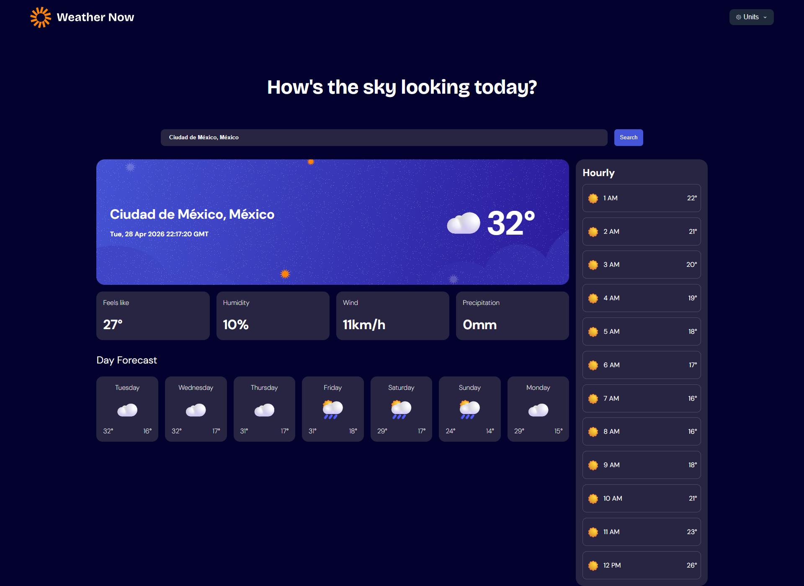

# 🌦️ Weather App — Frontend Mentor Challenge

## 📝 Brief

This project is a solution to a weather application challenge using the **Open-Meteo API**. The goal is to build a responsive and interactive weather app that closely matches the provided design.

Users can search for locations, view current weather conditions, and explore detailed forecasts.

---

## 🚀 Tech Stack

* ⚛️ React + ⚡ Vite
* 🔷 TypeScript
* 📡 Axios (API requests)
* 🎨 CSS (custom styling, no heavy UI frameworks)

---

## ✨ Features

* 🔍 Search weather by location

* 🌡️ Current weather:

  * Temperature
  * Weather condition icon
  * Location details

* 📊 Additional metrics:

  * Feels like temperature
  * Humidity
  * Wind speed
  * Precipitation

* 📅 7-day forecast:

  * Daily high/low temperatures
  * Weather icons

* ⏰ Hourly forecast:

  * Temperature changes throughout the day
  * Day selector to switch between days

* ⚙️ Units customization:

  * Metric / Imperial toggle
  * Temperature: Celsius / Fahrenheit
  * Wind: km/h / mph
  * Precipitation: millimeters

* 📱 Fully responsive design

* 🎯 Hover and focus states for interactive elements

---

## 📡 API

This project uses:

* 🌐 Open-Meteo API
  https://open-meteo.com/

---

## 🛠️ Installation & Setup

Clone the repository:

```bash
git clone https://github.com/JuanferGG/retos-frontend-mentor-3
cd weather app
```

Install dependencies:

```bash
pnpm install
```

Run the development server:

```bash
pnpm dev
```

---

## 📂 Project Structure (simplified)

```
src/
│── components/
│── hooks/
│── services/      # API calls (Axios)
│── types/         # TypeScript types
│── styles/
│── App.tsx
│── main.tsx
```

---

## 🎯 Goals of this project

* Practice API integration with Axios
* Strengthen TypeScript usage in React
* Build responsive UI without heavy libraries
* Improve component structure and state management

---

## 🔮 Possible Improvements

* 🌍 Geolocation support (auto-detect user location)
* ⭐ Save favorite locations
* 🌙 Dark / Light mode
* ⚡ Performance optimizations (caching, memoization)
* 🧪 Unit testing

---

## 🙌 Acknowledgments

* Challenge by Frontend Mentor
* Weather data by Open-Meteo

---

## 🖼️ Desktop Image




## 📌 Author

Developed by **[JuanferGG]**
